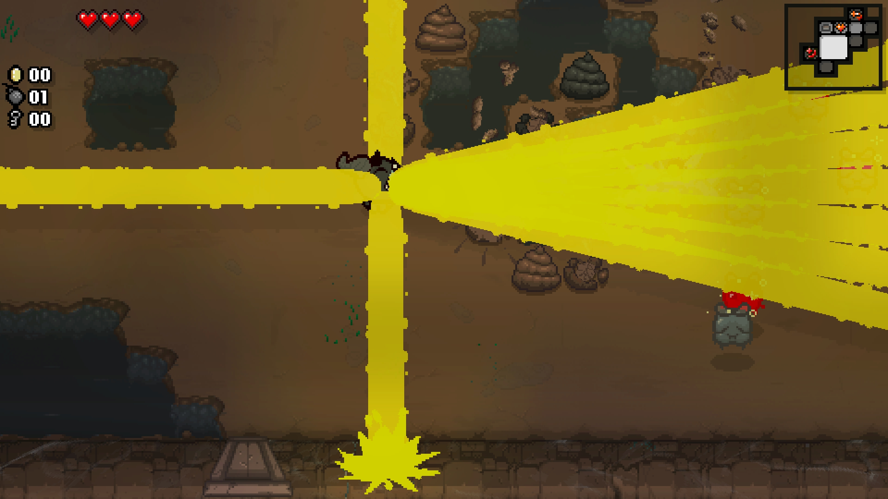
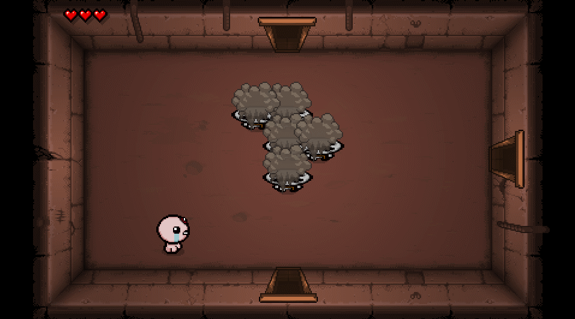
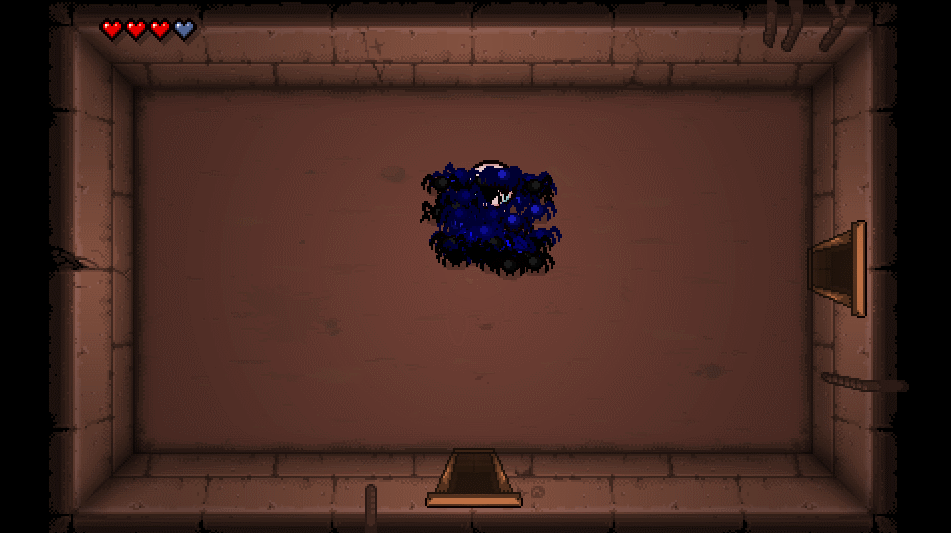

La prima volta che ho giocato ad Isaac è stato su Steam, avevo acquistato il gioco con poche aspettative, ma mi intrigava la visuale top down stile il primo **The Legend of Zelda** per <abbr title="Nintendo Enterntainment System">NES</abbr>.

La prima release del gioco era stata sviluppata interamente in *Shockwave Flash*, un web player ormai defunto che supportava *ActionScript* un linguaggio facile da imparare ma comunque con delle limitazioni. Quella versione era svilupata con disegni vettoriali, abbastanza semplici non troppo brillanti ma ben animati.

Successivamente, ne uscì una versione completamente riprogrammata, lo scopo era l'abbandono di flash per poter avere un engine più performante e con meno bug, ma soprattutto portabile su più piattaforme.

### Meccaniche

Ho trovato il gioco immediatamente severo, crudo e senza nessun tipo di aiuto verso il giocatore, eppure semplice e chiaro, privo di insicurezze per quanto riguarda le meccaniche e il modo in cui il personaggio interagisce con i pericolosi labirinti, dove la morte è sempre in agguato, pronta a colpire da un momento all'altro.

La meraviglia di questo gioco sta nel loot system concatenabile, dove ogni oggetto che viene trovato si addiziona alle abilità di Isaac. Queste abilità sono tutt'altro che banali e ripetitive, nel gioco ci sono una marea di oggetti, così tanti da non permetere al giocatore di ricordarsi a cosa servano e dando alla partita sempre delle pieghe differenti in quanto difficilmente ci ritroveremo con le stesse abilità ogni volta.

Gli oggetti che si raccolgono permettono ad Isaac di sparare in modo totalmente differente, di superare ostacoli, rimbalzare, deformare il percorso del proiettile o del raggio lanciato.

### Gameplay

In totale, contando gli oggetti tra le pagine di [Gamepedia][gamepedia], vanta di **125 ciondoli**, **120 oggetti consumabili** e **410 oggetti passivi**, dove ogni oggetto ha delle ripercussioni sul gameplay davvero molto eterogenee e danno alla partita una variabilità che ti fa vivere in un continuo stato di dubbio e tensione.

La quantità di oggetti è così vasta che è impossibile ricordarsi gli effetti di ogni singolo oggetto e se ciò che stiamo per raccogliere valorizza quelli precedenti in quanto a prestazioni, avere una guida sotto al naso non aiuta più di tanto perché è necessario verificare ogni volta tutta la lista per riconoscere quale stiamo per raccogliere. Probabilmente questa struttura non è così a caso, l'ideatore voleva che il giocatore vivesse l'avventura in **pieno stile roguelike** e più di così si muore, infatti si muore continuamente.

Prendere l'oggetto sbagliato potrebbe rovinare una partita perfetta, anche quando quest'ultimo porta una serie dei benefici. Qui si mostra il genio di **Edmund McMillen**, vettore di un bilanciamento che rende il gioco imprevedibile e allo stesso tempo coerente col suo immaginario.

### Atmosfera

Tutto l'immaginario di **Edmund McMillen** (principale autore) ci mostra un gioco angosciante, perverso e coerente con le paure che la mente di un bambino di 5 anni ha, quindi cacca, pipì, sangue, puzza, cibo disgustoso, animali abominevoli, interiora, marciume, sporco, etc. Ci ho visto una relazione con l'immaginario horror degli anni '80-90, mi ricorda parecchio gli [Sgorbions][sgorbions], a sua volta parodia delle bambole americane [Cabbage Patch Kids][cabbage].

### Storia

Oltre a questa atmosfera horror del mondo di un infante, la storia è ispirata alla vicenda biblica di [Isacco][isacco]. Narra del bambino Isaac e di sua madre, intenta ad ucciderlo per il volere divino, in quanto corrotto dal male, la narrazione gioca sulla vicenda mettendo in dubbio che i fatti stiano accadendo realmente o tutto sia frutto dell'immaginazione di Isaac, in quanto tutto è basato sui suoi disegni, assieme a momenti della vita reale come si può notare nei vari finali.

A causa della tematica a fondo religioso, inizialmente il gioco non venne pubblicato su App Store di Apple, in quanto giudicato blasfemo, tuttavia ora lo si può acquistare anche li.

### Combattimenti

Ho trovato il gioco subito severo e con un AI basilare ma terribilmente malefica e insidiosa, i mostri sono sempre pronti a prenderti di sorpresa, nonostante tu stia attento, spesso le creature ti prenderanno in contropiede a causa dei loro movimenti spesso inprevedibili. Il comportamento dei mostri è piuttosto vario, e come il nostro personaggio, anche loro hanno una serie di modificatori che ne virano gli attacchi e il comportamento, non così tanti come Isaac, ma comunque regalano sempre varietà e non ci fanno mai abbassare la guardia.

Anche il più insignificante dei nemici, come i maledetti ragnetti, sono sempre pericolosi e sanno rovinarti l'umore colpendoti a tradimento con uno scatto improvviso.

Gli scontri coi boss sono abbastanza semplici, a parte Ultra Creed che può essere davvero frustrante da abbattere e qualche altro mostro, tuttavia l'essenza del combattimento sta nello schivare i mostri nelle stanze, soprattutto a difficoltà hard core il gioco sa essere davvero un bastardo.

### Pixel art

La pixel grafica è di per se curata in maniera minuziosa, il gioco vanta di un bestiario esageratamente vasto, **183 mostri** e **196 boss** differenti, dietro questo gioco c'è un lavoro immane, splendidamente disegnato.

Inizialmente non ero molto contento della notizia di questo cambio, ma giocandoci ho notato che è molto più curata della precedente, probabilmente dietro alla scelta stilistica c'è la comodità degli asset in pixel grafica, decisamente più scalabili, più facili da disenare, si semplifica il riciclo degli elementi tra i vari mostri e probabilmente la grafica è più facilmente riproducibile a livello di team di sviluppo.

Un punto negativo sulla grafica è lo scaling degli asset grafici, necessario a tutta una serie di dinamiche di gioco legate alla dimesione variabile di proiettili e personaggi, che così possono essere più o meno facili da colpire. Di fatto è importante per il gameplay, peccato che faccia sembrare il gioco meno curato di quello che in realtà è.

Si può notare anche un po' di sbavatura nello scaling generale (almeno su Nintendo Switch) che non disturba più di tanto perché molto leggero e non sempre presente, però non è sicuramente lodevole.

### Musiche

Decisamente rinnovate rispetto all'originale, anche la colonna sonora è stata riscritta per avere un gioco più profondo e curato, di norma non sono nulla di speciale, ma sanno accompagnare il gioco molto bene, senza voler essere protagoniste, ma solo di accompagnamento ad un atmosfera da hard rock satanico non troppo cattiva.

### Level design

Non c'è dubbio sul fatto che questo gioco sia fortemente ispirato al primo Zelda, i potenziamenti che si raccolgono permettono di interagire maggiormente con il mondo ma di norma è proprio come giocare ai dungeon di Zelda, si possono trovare molte stanze segrete con le bombe proprio come sul titolo NES e in aggiunta ci sono tutta una serie di meccaniche che non ne rovinano la struttura, anzi, la esaltano. Anche le pietre possono nascondere oggetti e in alcuni casi anche passaggi a botole segrete che portano ad una stanza con all'interno un oggetto.

Di base è tutto random, ma per un gioco roguelike come questo è l'ideale.

---

### Verdetto

Isaac da il massimo proprio nei punti cruciali dove un titolo indie come questo dovrebbe fare, per quanto sia semplice, il level design e la meccanica [Roguelike][roguelike] molto simile al bellissimo [Risk of Rain][ror] lo rendono incredibilimente longevo e divertente, soprattutto per la piega che può prendere una partita e il modo improvviso in cui tutto può cambiare, con un po' di fortuna o con una botta di sfiga.

[cabbage]: http://www.cabbagepatchkids.com/
[gamepedia]: https://bindingofisaacrebirth.gamepedia.com/
[isacco]: https://it.wikipedia.org/wiki/Isacco
[roguelike]: https://it.wikipedia.org/wiki/Roguelike
[ror]: https://riskofraingame.com/
[sgorbions]: https://it.wikipedia.org/wiki/Sgorbions
