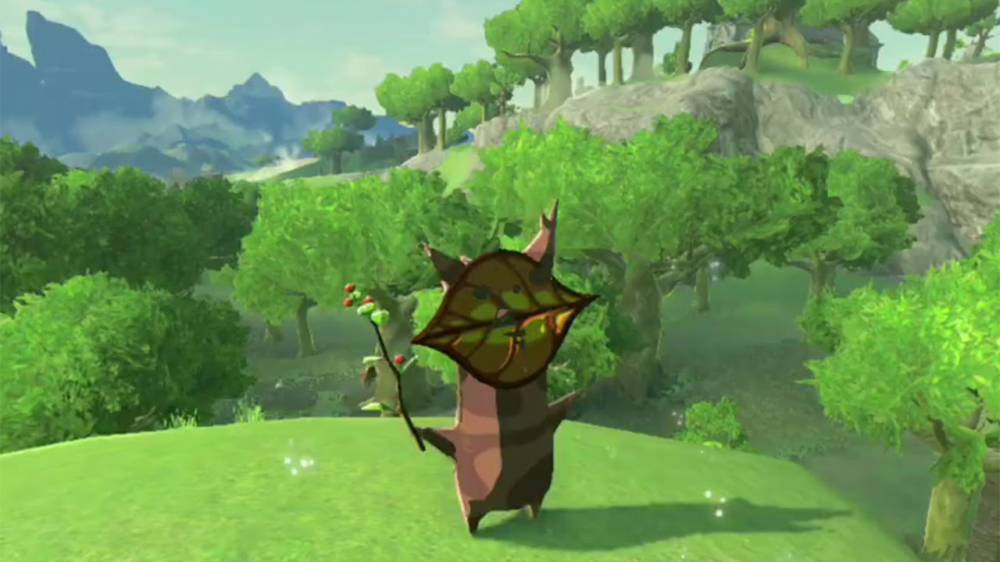
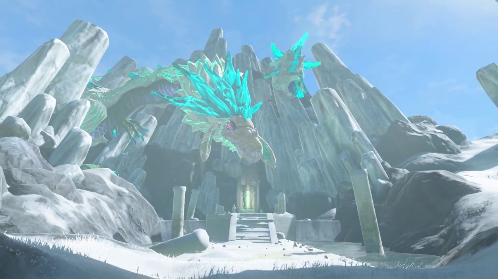

Come la stragrande maggioranza di chi ha acquistato un [Nintendo Switch][switch] i primi giorni dal lancio, anche io ho scelto come primo titolo [Breath of the Wild][breath]. Totalmente rapito dagli screenshot che giravano online, sono stato colpito dalla sensazione di un mondo vivo, emozionale e in qualche modo anche malinconico.

### Atmosfera

Fin dai primi istanti si ha la sensazione di essere all'interno di un lungometraggio di Studio Ghibli, quello che arriva subito sono le emozioni di fronte ad un luogo incontaminato e selvaggio, apparentemente tranquillo e sicuramente molto vasto.

Oltre a riprendere visivamente opere come Princess Mononoke, il motore proprietario di Nintendo rappresenta le ambientazioni con l'effetto [En Plain Air][youtube-epa], come detto all'E3 da [Artsy Omni][artsy].

Si avverte il senso di un mondo misterioso e sacro, di una semplicità visiva che nasconde una grande complessità strutturale, grazie anche al motore fisico e a come il team è riuscito ad integrarlo con le meccaniche di gioco.

### Motore fisico

Probabilmente tra i più brillanti che si possono trovare in un video gioco, pochi titoli sanno rendere così intuitivo un motore fisico, come il materiale degli oggetti che reagisce ai reagenti ai quali li sottoponiamo, oltre che al peso, alle leve e ai vari modi con cui possiamo giocare col mondo, è possibile bruciare il legno, spegnere il fuoco con l'acqua, condurre elettricità tramite materiali metallici, vedere incendi seguire il verso del vento, e non basta, ci sono decine e decine di modi con i quali si può interagire con il motore fisico, permettendo di donare un sacco di sorprese divertenti, appaganti e incredibilmente intuitive.

### Esplorazione

Muoversi per Hyrule è molto stimolante, la zona nella quale è possibile muoversi è molto vasta ma sempre piena di scorci interessanti, luoghi da visitare e personaggi con i quali interagire o avversari da fronteggiare.

I biomi delle aree di gioco sono suddivisi dai classici fattori come geologia, fauna e flora, tuttavia viene introdotto anche un aspetto legato alla temperatura atmosferica che rende l'esperienza più survival, impedendo così al giocatore di addentrarsi in alcune aree a meno che prima non si sia procurato l'equipaggiamento adatto.

Mi ha colpito moltissimo la possibilità di scalare la stragrande maggioranza di superfici, infatti è possibile arrivare praticamente ovunque, l'importante è avere abbastanza forza residua, altrimenti converrà tornare una volta acquisite le risorse sufficienti a superare l'ostacolo. In questo modo il mondo risulta colmo di posti che possiamo raggiungere ma che siamo costretti a lasciare li per poter tornare successivamente, riusciremo a ricordarcene? Molto probabilmente no, so che ho lasciato indietro molte aree e non sempre ne ricordo la posizione esatta.

### Segreti

Ad oggi, dubito che esista un gioco che possa offrire un così vasto numero di segreti. Sono semplicemente ovunque, come i 900 Korok, che potrebbero essere sotto ad un sasso, dietro ad una statua per le offerte, potrebbero celarsi in un punto specifico dell'acqua.

Non sono solo questi i segreti di Breath of the Wild, ce ne sono di ogni genere, dai sacrari, i draghi erranti, i set di armature, le armi, i cavalli, le oasi delle fate, in pratica ogni cosa è fatta per essere scoperta e mai realmente necessaria per ultimare il gioco, la quest principale di per se non è particolarmente lunga, è il perdersi in questo meraviglioso mondo, così colmo di dettagli che ci fa vivere la vera essenza di come è stato pensato.

### Combattimenti

Anche un album come [Dark Side of the Moon][pink] ha per chi l'ascolta una parte più interessante, nonostante sia considerato uno degli album più importanti del 900, non può esistere un album dove amiamo alla stessa maniera ogni canzone. Così è anche per **Breath of the Wild**, l'aspetto che forse mi ha colpito meno sono i combattimenti

[artsy]: https://twitter.com/artsyomni
[breath]: http://www.nintendo.it/Giochi/Nintendo-Switch/The-Legend-of-Zelda-Breath-of-the-Wild-1173609.html
[pink]: https://it.wikipedia.org/wiki/The_Dark_Side_of_the_Moon
[switch]: https://www.nintendo.com/switch/
[youtube-epa]: https://youtu.be/sf4gtlM0mYs?t=1m51s
